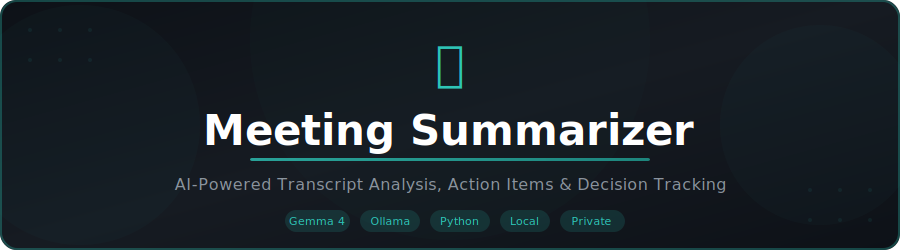
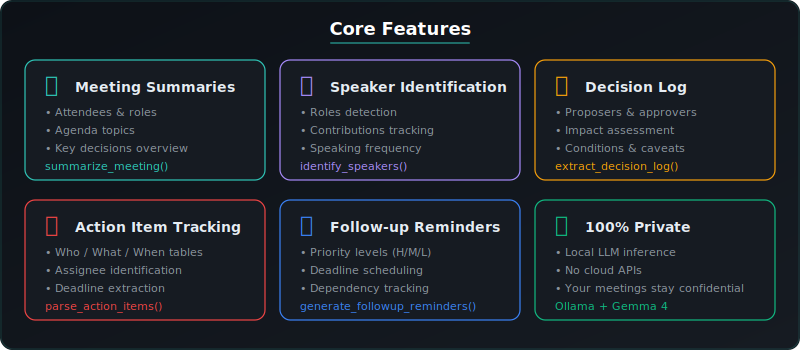
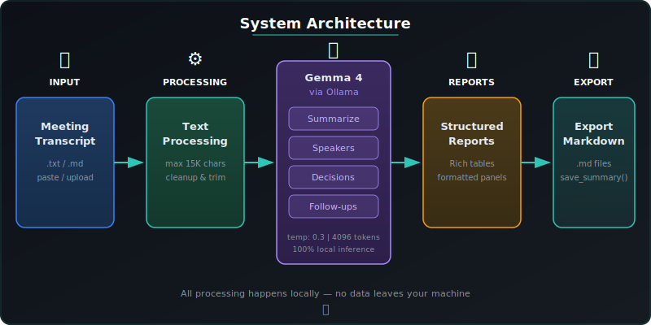

<div align="center">



<br />

[](https://python.org)
[](https://ollama.com/library/gemma4)
[](https://click.palletsprojects.com)
[](https://streamlit.io)
[](LICENSE)
[]()
[]()

**Production-grade meeting transcript analyzer powered by a local LLM.**
<br />
Extracts attendees, decisions, action items, and follow-ups — all 100 % private.

[Quick Start](#-quick-start) · [CLI Reference](#-cli-reference) · [API](#-api-reference) · [Architecture](#-architecture) · [FAQ](#-faq)

<br />

<strong>Part of <a href="https://github.com/kennedyraju55/90-local-llm-projects">90 Local LLM Projects</a> collection</strong>

</div>

<br />

---

## 🎯 Why This Project?

<table>
<tr>
<th>Problem</th>
<th>How Meeting Summarizer Helps</th>
</tr>
<tr>
<td>Meetings end, notes get lost</td>
<td>Generates structured summaries with attendees, decisions &amp; action items automatically</td>
</tr>
<tr>
<td>Action items slip through the cracks</td>
<td>Extracts <strong>Who / What / When</strong> tables so nothing gets missed</td>
</tr>
<tr>
<td>Hard to track decisions across meetings</td>
<td>Builds a decision log with proposers, approvers &amp; impact assessments</td>
</tr>
<tr>
<td>Follow-ups have no clear ownership</td>
<td>Creates prioritized reminders with responsible person, deadline &amp; dependencies</td>
</tr>
<tr>
<td>Cloud transcription tools raise privacy concerns</td>
<td>Runs <strong>entirely locally</strong> — your meetings never leave your machine</td>
</tr>
</table>

---

## ✨ Features

<div align="center">

</div>

<br />

| Feature | Description | Function |
|---------|-------------|----------|
| 📋 **Meeting Summaries** | Attendees, agenda, key decisions, 2–3 sentence overview | `summarize_meeting()` |
| 👥 **Speaker Identification** | Names, roles, speaking frequency, key contributions | `identify_speakers()` |
| ✅ **Decision Log** | Numbered decisions with proposers, approvers, caveats, impact | `extract_decision_log()` |
| 📝 **Action Item Tracking** | Who / What / When tables extracted from natural conversation | `summarize_meeting()` |
| 🔄 **Follow-up Reminders** | Priority (High/Medium/Low), deadlines, dependencies | `generate_followup_reminders()` |
| 💾 **Markdown Export** | Save any report to `.md` for sharing or archiving | `save_summary()` |
| 🖥️ **Dual Interface** | Full CLI (Click) + Web UI (Streamlit) | — |
| 🔒 **100 % Private** | Local Gemma 4 via Ollama — no cloud, no API keys | — |

---

## 🚀 Quick Start

### Prerequisites

| Requirement | Version | Purpose |
|-------------|---------|---------|
| Python | 3.11+ | Runtime |
| [Ollama](https://ollama.com) | Latest | Local LLM server |
| Gemma 4 | — | Language model |

### 1 — Clone & Install

```bash
git clone https://github.com/kennedyraju55/meeting-summarizer.git
cd meeting-summarizer
pip install -r requirements.txt
```

### 2 — Start Ollama & Pull the Model

```bash
ollama serve          # start the Ollama daemon (if not already running)
ollama pull gemma4    # download Gemma 4 (~5 GB)
```

### 3 — Summarize Your First Meeting

Create a sample transcript file `meeting.txt`:

```text
Sarah (PM): Good morning everyone. Let's start with the sprint review.
James (Dev Lead): The authentication module is complete. We hit 95% test coverage.
Lisa (Designer): The new dashboard mockups are ready for review.
Sarah (PM): Great. James, can you review Lisa's mockups by Friday?
James (Dev Lead): Sure, I'll prioritize that.
Sarah (PM): We also need to decide on the deployment date.
James (Dev Lead): I propose next Wednesday. We'll have the staging tests done by Monday.
Lisa (Designer): That works for me.
Sarah (PM): Agreed. Wednesday deployment it is. Lisa, can you prepare the release notes?
Lisa (Designer): I'll have them ready by Tuesday EOD.
Sarah (PM): Perfect. Let's also schedule a post-deployment review for Thursday.
```

Run the summarizer:

```bash
python -m src.meeting_summarizer.cli summarize \
  --transcript meeting.txt \
  --output summary.md
```

<details>
<summary><strong>📄 Example Output</strong> (click to expand)</summary>

```
╭──────────────── 📋 Meeting Summary ─────────────────╮
│                                                      │
│  Sprint review meeting covering authentication       │
│  completion, dashboard mockups, and deployment        │
│  planning. Team aligned on Wednesday deployment.      │
│                                                      │
╰──────────────────────────────────────────────────────╯

╭──────────────────── 👥 Attendees ────────────────────╮
│                                                      │
│  - Sarah (Project Manager)                           │
│  - James (Dev Lead)                                  │
│  - Lisa (Designer)                                   │
│                                                      │
╰──────────────────────────────────────────────────────╯

╭──────────────── 📌 Agenda Topics ────────────────────╮
│                                                      │
│  - Sprint review / authentication module             │
│  - Dashboard mockup review                           │
│  - Deployment date decision                          │
│                                                      │
╰──────────────────────────────────────────────────────╯

╭──────────────── ✅ Key Decisions ────────────────────╮
│                                                      │
│  - Deploy next Wednesday                             │
│  - James to review Lisa's mockups by Friday          │
│                                                      │
╰──────────────────────────────────────────────────────╯

         📝 Action Items
┏━━━━━━━━━┳━━━━━━━━━━━━━━━━━━━━━━━━━━┳━━━━━━━━━━━━━━━┓
┃ Who     ┃ What                     ┃ When          ┃
┡━━━━━━━━━╇━━━━━━━━━━━━━━━━━━━━━━━━━━╇━━━━━━━━━━━━━━━┩
│ James   │ Review dashboard mockups │ Friday        │
│ Lisa    │ Prepare release notes    │ Tuesday EOD   │
│ Sarah   │ Schedule post-deploy     │ Thursday      │
│         │ review                   │               │
└─────────┴──────────────────────────┴───────────────┘

╭──────────────── 🔄 Follow-ups ──────────────────────╮
│                                                      │
│  - Post-deployment review (Thursday)                 │
│  - Staging test results review (Monday)              │
│                                                      │
╰──────────────────────────────────────────────────────╯

✅ Summary saved to: summary.md
```

</details>


## 🐳 Docker Deployment

Run this project instantly with Docker — no local Python setup needed!

### Quick Start with Docker

```bash
# Clone and start
git clone https://github.com/kennedyraju55/meeting-summarizer.git
cd meeting-summarizer
docker compose up

# Access the web UI
open http://localhost:8501
```

### Docker Commands

| Command | Description |
|---------|-------------|
| `docker compose up` | Start app + Ollama |
| `docker compose up -d` | Start in background |
| `docker compose down` | Stop all services |
| `docker compose logs -f` | View live logs |
| `docker compose build --no-cache` | Rebuild from scratch |

### Architecture

```
┌─────────────────┐     ┌─────────────────┐
│   Streamlit UI  │────▶│   Ollama + LLM  │
│   Port 8501     │     │   Port 11434    │
└─────────────────┘     └─────────────────┘
```

> **Note:** First run will download the Gemma 4 model (~5GB). Subsequent starts are instant.

---


---


---

## ⚡ REST API

Every project includes a FastAPI REST API with auto-generated docs.

### Start the API Server

```bash
# Run directly
uvicorn src.meeting_summarizer.api:app --reload --port 8000

# Or with Docker
docker compose up
```

### API Endpoints

| Method | Endpoint | Description |
|--------|----------|-------------|
| `GET` | `/health` | Health check |
| `GET` | `/docs` | Interactive Swagger UI |
| `GET` | `/redoc` | ReDoc documentation |
| `POST` | `/analyze` | Main analysis endpoint |

### Example Request

```bash
curl -X POST http://localhost:8000/analyze \
  -H "Content-Type: application/json" \
  -d '{"text": "your input here"}'
```

> 📖 Visit `http://localhost:8000/docs` for the full interactive API documentation.

## 📖 CLI Reference

The CLI is built with [Click](https://click.palletsprojects.com) and uses [Rich](https://rich.readthedocs.io) for formatted terminal output.

### Global Options

| Option | Short | Description |
|--------|-------|-------------|
| `--verbose` | `-v` | Enable verbose / debug logging |
| `--config` | — | Path to a custom `config.yaml` file |

### `summarize` — Full Meeting Summary

Generate a structured meeting summary with attendees, agenda, decisions, action items, and follow-ups.

```bash
python -m src.meeting_summarizer.cli summarize \
  --transcript meeting.txt \
  --output summary.md
```

| Option | Required | Description |
|--------|----------|-------------|
| `--transcript` | ✅ | Path to the transcript file |
| `--output` | — | Save the summary to a Markdown file |

**Output sections:** ATTENDEES · AGENDA TOPICS · KEY DECISIONS · ACTION ITEMS (Who/What/When table) · FOLLOW-UPS · SUMMARY

---

### `speakers` — Speaker Identification

Profile every speaker in the transcript with role detection and contribution analysis.

```bash
python -m src.meeting_summarizer.cli speakers --transcript meeting.txt
```

| Option | Required | Description |
|--------|----------|-------------|
| `--transcript` | ✅ | Path to the transcript file |

**Output fields:** Name · Role · Times Spoken · Key Contributions

---

### `decisions` — Decision Log

Extract a numbered decision log with full context for each decision made.

```bash
python -m src.meeting_summarizer.cli decisions --transcript meeting.txt
```

| Option | Required | Description |
|--------|----------|-------------|
| `--transcript` | ✅ | Path to the transcript file |

**Output fields:** Decision # · Description · Proposer · Approvers · Conditions/Caveats · Impact Assessment

---

### `followups` — Follow-up Reminders

Generate prioritized follow-up items with deadlines and dependency tracking.

```bash
python -m src.meeting_summarizer.cli followups --transcript meeting.txt
```

| Option | Required | Description |
|--------|----------|-------------|
| `--transcript` | ✅ | Path to the transcript file |

**Output fields:** Description · Responsible Person · Deadline · Priority (High/Medium/Low) · Dependencies

---

### Verbose Mode

Add `-v` to any command for detailed logging:

```bash
python -m src.meeting_summarizer.cli -v summarize --transcript meeting.txt
```

### Custom Config

Override the default `config.yaml`:

```bash
python -m src.meeting_summarizer.cli --config custom.yaml summarize --transcript meeting.txt
```

---

## 🌐 Web UI

Meeting Summarizer also ships with a [Streamlit](https://streamlit.io) web interface:

```bash
streamlit run src/meeting_summarizer/web_ui.py
```

**Web UI features:**

- 📤 Upload or paste transcript text
- 📊 Tabbed views — Summary · Speakers · Decisions · Follow-ups
- 📋 One-click copy for any section
- 💾 Download results as Markdown

---

## 🏗️ Architecture

<div align="center">

</div>

<br />

### Data Flow

```
Transcript → preprocess_transcript() → LLM prompt → Ollama (Gemma 4) → Parsed response → Rich output / .md file
```

### Project Structure

```
13-meeting-summarizer/
├── src/
│   └── meeting_summarizer/
│       ├── __init__.py          # Package metadata, version
│       ├── core.py              # Business logic (summarize, speakers, decisions, follow-ups)
│       ├── cli.py               # Click CLI commands & Rich display
│       ├── config.py            # YAML config loader with env overrides
│       ├── utils.py             # Transcript I/O, LLM client, parsing helpers
│       └── web_ui.py            # Streamlit web interface
├── tests/
│   ├── __init__.py
│   ├── test_core.py             # Unit tests for core functions
│   └── test_cli.py              # CLI integration tests
├── docs/
│   └── images/
│       ├── banner.svg           # Project banner
│       ├── architecture.svg     # System architecture diagram
│       └── features.svg         # Feature overview cards
├── config.yaml                  # Default configuration
├── setup.py                     # Package setup with console_scripts entry point
├── requirements.txt             # Runtime + dev dependencies
├── Makefile                     # Common dev commands
├── .env.example                 # Environment variable template
├── .gitignore
└── README.md
```

### Key Design Decisions

| Decision | Rationale |
|----------|-----------|
| Gemma 4 via Ollama | High-quality local inference, no API keys, full privacy |
| Click for CLI | Composable command groups, built-in help, type validation |
| Rich for output | Beautiful tables, panels, progress indicators in the terminal |
| Prompt templates in `core.py` | Co-located with logic for easy iteration |
| Separate `utils.py` | Keeps `core.py` focused on business logic |

---

## 🔌 API Reference

### `summarize_meeting(transcript, config=None)`

Generate a full structured summary from a meeting transcript.

```python
from meeting_summarizer.core import summarize_meeting

transcript = open("meeting.txt").read()
summary = summarize_meeting(transcript)
print(summary)
```

**Parameters:**

| Name | Type | Default | Description |
|------|------|---------|-------------|
| `transcript` | `str` | — | Raw meeting transcript text |
| `config` | `dict \| None` | `None` | Override config (uses `config.yaml` if `None`) |

**Returns:** `str` — Structured summary with sections: ATTENDEES, AGENDA TOPICS, KEY DECISIONS, ACTION ITEMS, FOLLOW-UPS, SUMMARY.

---

### `identify_speakers(transcript, config=None)`

Profile every speaker found in the transcript.

```python
from meeting_summarizer.core import identify_speakers

result = identify_speakers(transcript)
```

**Returns:** `str` — Structured speaker profiles with name, role, times spoken, and key contributions.

---

### `extract_decision_log(transcript, config=None)`

Extract a numbered decision log from the transcript.

```python
from meeting_summarizer.core import extract_decision_log

decisions = extract_decision_log(transcript)
```

**Returns:** `str` — Decision log with decision number, description, proposer, approvers, conditions/caveats, and impact assessment.

---

### `generate_followup_reminders(transcript, config=None)`

Create prioritized follow-up reminders from the transcript.

```python
from meeting_summarizer.core import generate_followup_reminders

followups = generate_followup_reminders(transcript)
```

**Returns:** `str` — Follow-up items with description, responsible person, deadline, priority (High/Medium/Low), and dependencies.

---

### `save_summary(summary, output_path)`

Save any summary string to a Markdown file.

```python
from meeting_summarizer.core import save_summary

save_summary(summary, "output/sprint-review.md")
```

**Parameters:**

| Name | Type | Description |
|------|------|-------------|
| `summary` | `str` | The summary text to save |
| `output_path` | `str` | Destination file path |

---

### Programmatic Usage — Full Example

```python
from meeting_summarizer.core import (
    summarize_meeting,
    identify_speakers,
    extract_decision_log,
    generate_followup_reminders,
    save_summary,
)
from meeting_summarizer.config import load_config

config = load_config("config.yaml")

with open("meeting.txt") as f:
    transcript = f.read()

# Generate all reports
summary   = summarize_meeting(transcript, config)
speakers  = identify_speakers(transcript, config)
decisions = extract_decision_log(transcript, config)
followups = generate_followup_reminders(transcript, config)

# Save results
save_summary(summary,   "output/summary.md")
save_summary(speakers,  "output/speakers.md")
save_summary(decisions, "output/decisions.md")
save_summary(followups, "output/followups.md")
```

---

## ⚙️ Configuration

### `config.yaml`

```yaml
llm:
  model: "gemma4"
  temperature: 0.3
  max_tokens: 4096

processing:
  max_transcript_length: 15000

output:
  default_format: "structured"
```

### Configuration Options

| Key | Default | Description |
|-----|---------|-------------|
| `llm.model` | `gemma4` | Ollama model name |
| `llm.temperature` | `0.3` | LLM sampling temperature (lower = more deterministic) |
| `llm.max_tokens` | `4096` | Maximum tokens in LLM response |
| `processing.max_transcript_length` | `15000` | Max characters before transcript truncation |
| `output.default_format` | `structured` | Output format |

### Environment Variable Overrides

| Variable | Overrides |
|----------|-----------|
| `MEETING_SUMMARIZER_MODEL` | `llm.model` |
| `MEETING_SUMMARIZER_TEMPERATURE` | `llm.temperature` |

```bash
export MEETING_SUMMARIZER_MODEL=gemma4
export MEETING_SUMMARIZER_TEMPERATURE=0.2
```

---

## 🧪 Testing

```bash
# Run all tests
python -m pytest tests/ -v

# With coverage
python -m pytest tests/ -v --cov=src/meeting_summarizer --cov-report=term-missing
```

### Test Structure

| File | Tests |
|------|-------|
| `tests/test_core.py` | Unit tests for `summarize_meeting`, `identify_speakers`, `extract_decision_log`, `generate_followup_reminders` |
| `tests/test_cli.py` | CLI integration tests for all commands and options |

---

## 🔒 Local vs. Cloud — Why Local?

| | Meeting Summarizer (Local) | Cloud Alternatives |
|---|---|---|
| **Privacy** | ✅ Transcript never leaves your machine | ❌ Uploaded to third-party servers |
| **Cost** | ✅ Free after model download | ❌ Per-token API charges |
| **Internet** | ✅ Works fully offline | ❌ Requires connectivity |
| **Speed** | ⚡ Depends on local hardware | ⚡ Generally fast (network latency) |
| **Customization** | ✅ Swap models, tune prompts freely | ⚠️ Limited to provider options |
| **Compliance** | ✅ No data residency concerns | ⚠️ May violate data policies |

---

## ❓ FAQ

<details>
<summary><strong>What transcript formats are supported?</strong></summary>

Plain text (`.txt`) and Markdown (`.md`). The transcript should include speaker labels (e.g., `Sarah (PM): ...` or `James:`) for best results. You can also paste text directly in the Streamlit Web UI.

</details>

<details>
<summary><strong>What happens if my transcript exceeds 15,000 characters?</strong></summary>

The `preprocess_transcript()` function in `utils.py` automatically trims the transcript to `processing.max_transcript_length` (default: 15,000 characters). You can increase this limit in `config.yaml`, but larger transcripts require more model memory and processing time.

</details>

<details>
<summary><strong>Can I use a different model instead of Gemma 4?</strong></summary>

Yes. Any model available through Ollama works. Update `llm.model` in `config.yaml` or set the `MEETING_SUMMARIZER_MODEL` environment variable:

```bash
export MEETING_SUMMARIZER_MODEL=llama3.1
```

</details>

<details>
<summary><strong>How much RAM / VRAM does Gemma 4 need?</strong></summary>

Gemma 4 via Ollama typically requires **8–16 GB RAM** (CPU mode) or **~6 GB VRAM** (GPU mode). For lower-resource machines, try a smaller model like `gemma3:4b`.

</details>

<details>
<summary><strong>Can I process audio/video recordings directly?</strong></summary>

Not directly. Meeting Summarizer works with text transcripts. Use a speech-to-text tool like [Whisper](https://github.com/openai/whisper) to transcribe audio first, then feed the transcript to Meeting Summarizer:

```bash
whisper recording.mp3 --output_format txt
python -m src.meeting_summarizer.cli summarize --transcript recording.txt
```

</details>

---

## 🛠️ Troubleshooting

<details>
<summary><strong>Ollama is not running</strong></summary>

```
Error: Ollama is not running.
```

Make sure the Ollama daemon is started before running any command:

```bash
ollama serve
```

On macOS / Linux, you can also run it as a background service. Verify it's responding:

```bash
curl http://localhost:11434/api/tags
```

</details>

<details>
<summary><strong>Model not found</strong></summary>

If you see a model-not-found error, pull the model first:

```bash
ollama pull gemma4
```

Verify available models:

```bash
ollama list
```

</details>

<details>
<summary><strong>Transcript too long / truncated results</strong></summary>

Transcripts exceeding `processing.max_transcript_length` (default: 15,000 chars) are automatically trimmed. To increase the limit, edit `config.yaml`:

```yaml
processing:
  max_transcript_length: 30000
```

> **Note:** Larger limits require more model memory and increase processing time.

</details>

<details>
<summary><strong>Out of memory errors</strong></summary>

Gemma 4 requires significant RAM. Try these mitigations:

1. Close other memory-intensive applications
2. Use a smaller model: `export MEETING_SUMMARIZER_MODEL=gemma3:4b`
3. Reduce `max_tokens` in `config.yaml`

</details>

---

## 🤝 Contributing

Contributions are welcome! Here's how to get started:

```bash
# 1. Fork & clone
git clone https://github.com/YOUR_USERNAME/meeting-summarizer.git
cd meeting-summarizer

# 2. Install dev dependencies
pip install -r requirements.txt
pip install -e ".[dev]"

# 3. Run existing tests to verify setup
python -m pytest tests/ -v

# 4. Create a feature branch
git checkout -b feature/your-feature-name

# 5. Make your changes & run tests
python -m pytest tests/ -v --cov=src/meeting_summarizer

# 6. Commit & push
git add .
git commit -m "feat: describe your change"
git push origin feature/your-feature-name

# 7. Open a pull request on GitHub
```

### Guidelines

- Follow existing code style and patterns
- Add tests for new functionality in `tests/`
- Update this README for user-facing changes
- Keep commits focused and well-described
- Use conventional commit messages (`feat:`, `fix:`, `docs:`, etc.)

### Areas for Contribution

| Area | Ideas |
|------|-------|
| 🧩 New analysis types | Sentiment analysis, risk identification, meeting scoring |
| 🌍 Internationalization | Multi-language transcript support |
| 📊 Output formats | JSON, CSV, PDF export |
| 🔌 Integrations | Slack, Teams, Notion connectors |
| 🧪 Testing | More edge cases, integration tests, performance benchmarks |

---

## 📄 License

This project is licensed under the **MIT License** — see [LICENSE](LICENSE) for details.

---

<div align="center">


<br /><br />

**[⬆ Back to Top](#)**

Built with ❤️ using [Ollama](https://ollama.com) · [Click](https://click.palletsprojects.com) · [Rich](https://rich.readthedocs.io) · [Streamlit](https://streamlit.io)

Part of the [90 Local LLM Projects](https://github.com/kennedyraju55/90-local-llm-projects) collection

</div>
